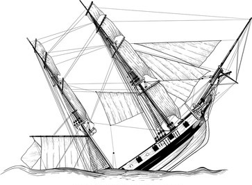

<!--  --- -->
<!--  title: "Analiza ladijskih nesreč" -->
<!--  author: "Bor Bregant" -->
<!--  date: 'date' -->
<!--  output: -->
<!--    html_document: default -->
<!--    pdf_document: -->
<!--      includes: -->
<!--        in_header: lib/styles.sty -->
<!--      latex_engine: xelatex -->
<!--    runtime: shiny -->
<!--  --- -->
<!--  Ta del mora biti v prvi vrstici da deluje -->

<!-- ======================================================================= -->

```{r setup, echo=FALSE, results='hide', message=FALSE, warning=FALSE}
knitr::opts_chunk$set(echo=FALSE, message=FALSE, warning=FALSE)
# Uvoz vseh potrebnih knjižnic
source("lib/libraries.r", encoding="UTF-8")
```

```{r rstudio, results='asis'}
# Izris povezave do RStudia na Binderju
source("lib/rstudio.r", encoding="UTF-8")
```
***
# Uvod

<p align="right">
  
</p>
<!--  Morda bi bilo bolje sirsa slika da gre tekst v visino? -->

V projektu je analiza nesreč z rekreativnimi plovili. Deskriptivno so prikazane okoliščine nesreč, analitično pa je vključena še linearna regresija števila smrtnih nesreč v oziru na število registriranih plovil in povprečnega prihodka državljana ZDA. V shiny je še spletna aplikacija, ki prikazuje število nesreč v oziru na okoliščine nesreče.

<p align="right">
  
</p>

Dodano je še nekaj splošno globalnih in lokalnih podatkov o regati <i> Volvo ocean race </i> (zgolj za potrebe predmeta, ne ker bi dodalo kakršnokoli vrednosti prvotni ideji nesreč).

***
# Spletna povezava do virov podatkov in grob opis podatkov izvlečenih tabel:

[2020 Recreational boating statistics](<https://uscgboating.org/library/accident-statistics/Recreational-Boating-Statistics-2020.pdf>)

[Pihodek v ZDA v letu 2020](<https://fred.stlouisfed.org/series/A792RC0A052NBEA>)

[The ocean race](<https://en.wikipedia.org/wiki/The_Ocean_Race>)
&#8195;
&#8195;
[The ocean race leta 1985/86](<https://en.wikipedia.org/wiki/1985%E2%80%931986_Whitbread_Round_the_World_Race>)


```{r uvoz, echo=FALSE, message=FALSE, warning=FALSE }
source("uvoz/uvoz.r", encoding="UTF-8")
```

1. TABELA: (Nesreče v posameznih mesecih)
<ol type="i">
  <li>Mesec                           (faktor)</li>
  <li>Smrtne nesreče                  (niz)</li>
  <li>Nesmrtne nesreče                (niz)</li>
  <li>Vse nesreče                     (niz)</li>
  <li>Procent smrtnih nesreč          (niz)</li>
  <li>Število smrti                   (stevilo)</li>
</ol>

2. TABELA: (Nesreče v posameznih letij)
<ol type="i">
  <li>Leto                            (stevilo)</li>
  <li>Smrtne nesreče                  (stevilo)</li>
  <li>Nesmrtne nesreče                (stevilo)</li>
  <li>Vse nesreče                     (stevilo)</li>
</ol>

3. TABELA: (Nesreče v posamezni zvezni državi)
<ol type="i">
  <li>Zvezna država                   (niz)</li>
  <li>Vse nesreče                     (stevilo)</li>
  <li>Smrtne nesreče                  (stevilo)</li>
  <li>Vse nesreče                     (stevilo)</li>
  <li>Oškodovani                      (stevilo)</li>
  <li>Število smrti                   (stevilo)</li>
  <li>Število ponesrečencev           (stevilo)</li>
  <li>Škoda v USD                     (stevilo)</li>
</ol>

4. TABELA: (Število registriranih plovil)
<ol type="i">
  <li>Leto        (stevilo)</li>
  <li>Število smrti   (stevilo)</li>
  <li>Število registriranih plovil    (stevilo)</li>
  <li>Delež smrtnih izidov    (stevilo)</li>
  <li>Število smrti v plovilih z motorjem   (stevilo)</li>
  <li>Število registriranih motornih plovil   (stevilo)</li>
  <li>Delež smrnih izidov z motornim plovilom   (stevilo)</li>
</ol>

5. TABELA: (Prihodek državljana ZDA)
<ol type="i">
  <li>Leto    (stevilo)</li>
  <li>Povprečni prihodek    (stevilo)</li>
</ol>

6. TABELA: (Vzrok nesreč)
<ol type="i">
  <li>Vzrok   (faktor)</li>
  <li>Število nesreč    (stevilo)</li>
  <li>Število smrti   (stevilo)</li>
  <li>Število poškodb   (stevilo)</li>
  <li>Tip nesreče   (niz)</li>
</ol>

7. TABELA: (Pregled regat Volvo ocean race)
<ol type="i">
  <li>Leto   (število)</li>
  <li>Klasa    (niz)</li>
  <li>Število kol   (stevilo)</li>
  <li>Število kratkih podregat   (stevilo)</li>
  <li>Število prijavljenih ekip   (število)</li>
  <li>Kraj začetka   (niz)</li>
  <li>Kraj konca   (niz)</li>
  <li>Zmagovalna barka   (niz)</li>
  <li>Zmagovalni skipper   (niz)</li>
</ol>

8. TABELA: (Pregled regate Volvo ocean race leta 1985/86)
<ol type="i">
  <li>Kolo   (niz)</li>
  <li>Datum začetka    (niz)</li>
  <li>Kraj začetka   (stevilo)</li>
  <li>Kraj konca   (stevilo)</li>
  <li>Razdalja   (število)</li>   <!--  NI OK KER NI TIDYDATA,,,, popravi uvoz -->
  <li>Zmagovalna ladja   (niz)</li>
  <li>Razdalja   (število)</li>
  <li>Zemlj. dolžina začetka   (število)</li>
  <li>Zemlj. širina začetka   (število)</li>
  <li>Zemlj. dolžina konca   (število)</li>
  <li>Zemlj. dolžina konca   (število)</li>
</ol>

***
# Vizualizacija podatkov

```{r vizualizacija, echo=FALSE, message=FALSE, warning=FALSE, results='hide'}
source("vizualizacija/vizualizacija.r", encoding="UTF-8")
```


Na zemljevidu ZDA je prikazano število smrtnih nesreč glede na posamezno zvezno državo.

```{r zemljevid, echo=FALSE, fig.align='left'}
zemljevid
```

Graf števila smrti v posameznem mesecu (v letu 2020)

```{r mesecnesmrti, echo=FALSE, message=FALSE, fig.align='left'}
mesecnesmrti
```

Graf števila smrti v posameznem letu

```{r letnesmrti, echo=FALSE, message=FALSE, fig.align='left'}
letnesmrti
```

## Za dodatek si oglejmo malo regate

Graf, ki prikazuje povzetek regat "Volvo ocean race" v letih 1973-2018. Sam graf ne pove kaj dosti, osi pa so tudi prisilno postavljene.

```{r brezvezengraf, echo=FALSE, message=FALSE, fig.align='left'}
brezvezengraf
```

Oglejmo si zgornjo regato v letu 2017/18. Na zemljevidu lahko vidimo posamezna kola tekme in okvirno pot (ki včasih skipperja pripelje na kopno `r knitr::asis_output("\U1F605")`.

```{r grafregate, echo=FALSE, message=FALSE, fig.align='left'}
grafregate
```

***
# Regresijska analiza

```{r analiza, echo=FALSE, message=FALSE, warning=FALSE, results='hide'}
source("analiza/analiza.r", encoding="UTF-8")
```

Grafa števila registriranih plovil in prihodka na prebivalca, ki bosta naši pojasnjevalni količini v regresijskem modelu.

```{r grafa, echo=FALSE, message=FALSE, fig.align='left'}
grafa
```

Spodaj vidimo rezultat regresijske analize. Postavimo hipotezo $H^{(1)}_0: \beta_1 =0$ in spotoma $H^{(2)}_0: \beta_2 = 0$, kjer se $\beta_1$ nanaša na število registriranih plovil, $\beta_2$ pa na prihodek. Iz izhoda vidimo, da $|t_1| < 1.96, |t_2| > 1.96$, zato ničelno hipotezo za registrirana plovila lahko zavrnemo.

Pod izhodom si oglejmo še diagnostiko predpostavk linearne regresije. $R^2$ je zelo majhen, kar ni dober znak. Rdeča črta ostankov proti fittanim vrednostim je sicer dobra (ravna okoli 0), a nas motijo same vrednosti (ta preveri samo linearnost podatkov). Drugi in tretji graf sta (morda presentljivo) zadovoljiva.

```{r povzetek, echo=FALSE, message=FALSE, fig.align='left'}
povzetek
```

```{r diagnostika, echo=FALSE, message=FALSE, fig.align='left'}
par(mfrow = c(2, 2))
plot(model)
```

Omenimo, da bi lahko pri linearni regresiji eliminirali trend pri prihodku na prebivalca, da bi to spremenljivko logaritmirali. S tem pristopom ničelne hipoteze tudi za število registriranih plovil ne moremo zavrniti.

***
# Shiny

<!-- V spodnjem grafičnem prikazu je predstavljeno število nesreč, smrti ter poškodb glede na posamezni tip nesreče, ki ga bralec izbere sam. -->

<!-- ```{r shiny, echo=FALSE} -->
<!-- shinyAppDir("shiny", options=list(width="100%", height=600)) -->
<!-- ``` -->
